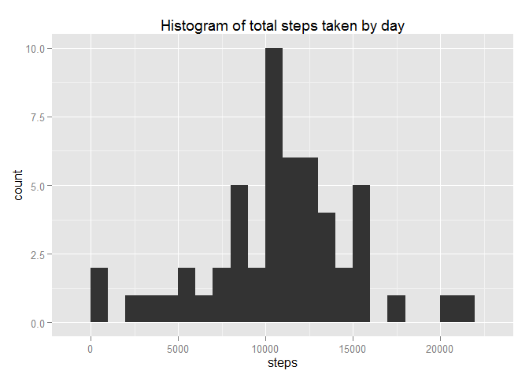
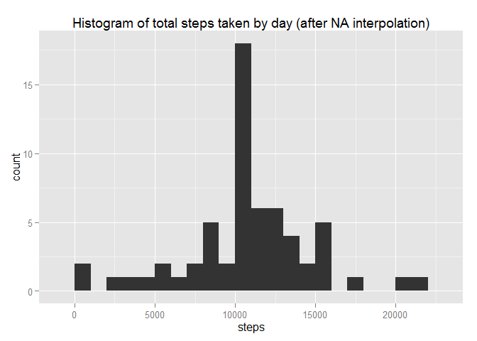
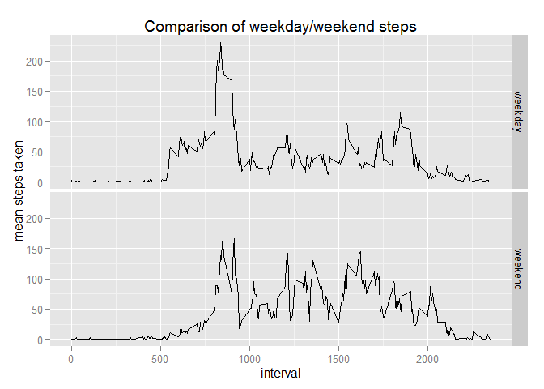

# Reproducible Research: Peer Assessment 1
## Load packages

```r
library(magrittr)
library(dplyr)
library(ggplot2)
library(lubridate)
```

## Loading and preprocessing the data

```r
# Unzip activity.zip
unzip("activity.zip")

# read csv file to variable "activity" and format date col using lubridate
activity <- read.csv("activity.csv", stringsAsFactors=FALSE)
activity %<>% mutate(date = ymd(date))
```

## What is mean total number of steps taken per day?

```r
#total steps per day
steps.by.day <- activity %>% filter(!is.na(steps)) %>% group_by(date) %>% 
  summarise(steps = sum(steps))

#histogram of steps by day
ggplot(steps.by.day, aes(steps)) + geom_histogram(binwidth = 1000) +
  ggtitle("Histogram of total steps taken by day")
```

 

```r
#Calculate mean and median
steps.by.day %>% summarise(mean = mean(steps), median = median(steps))
```

```
## Source: local data frame [1 x 2]
## 
##       mean median
## 1 10766.19  10765
```

## What is the average daily activity pattern?

```r
#find average of steps taken, grouped by interval
mean.steps.by.interval <- activity %>% filter(!is.na(steps)) %>% group_by(interval) %>% 
  summarise(mean.steps = mean(steps))

# time series plot of mean steps, by interval
ggplot(mean.steps.by.interval, aes(interval,mean.steps)) + geom_line()
```

 

```r
# which interval has the most steps?
a <- max(mean.steps.by.interval$mean.steps)
filter(mean.steps.by.interval, mean.steps == a)
```

```
## Source: local data frame [1 x 2]
## 
##   interval mean.steps
## 1      835   206.1698
```


## Inputting missing values

```r
# Calculate and report the total number of missing values in the dataset (i.e. the total number of rows with NAs)
# There are no NA's in fields date and interval:
activity[(is.na(activity$date) | is.na(activity$interval)),]
```

```
## [1] steps    date     interval
## <0 rows> (or 0-length row.names)
```

```r
# Collect NA rows into one object
activity.NArows <- activity[is.na(activity$steps),]
# Total number of NA rows:
length(activity.NArows$interval)
```

```
## [1] 2304
```

```r
# Create a new dataset "activity.new" that is equal to the original dataset but with the missing data filled in with the value from the previous calculation of mean.steps.by.interval

#initialize new dataset
activity.new <- activity

# loop through each element and assign new value
for(i in 1:17568){
  if(is.na(activity.new[i,1])){
    activity.new[i,1] <- as.numeric(mean.steps.by.interval[mean.steps.by.interval$interval == activity.new[i,3],2])
  }
}

#total steps per day
steps.by.day.new <- activity.new %>% filter(!is.na(steps)) %>% group_by(date) %>% 
  summarise(steps = sum(steps))

#histogram of steps by day
ggplot(steps.by.day.new, aes(steps)) + geom_histogram(binwidth = 1000) +
  ggtitle("Histogram of total steps taken by day (after NA interpolation)")
```

 

```r
#Calculate mean and median
steps.by.day.new %>% summarise(mean = mean(steps), median = median(steps))
```

```
## Source: local data frame [1 x 2]
## 
##       mean   median
## 1 10766.19 10766.19
```
These values are very close to the estimates from earlier in the analysis, where we found the mean and median of steps by day.  Earlier, the values were: mean 10766.19, median 10765.  Now the values are mean 10766.19, and median 10766.19.  This method did not have an observable effect on the mean, and it shifted the median towards the mean by 1.19.  This may be due to there being a higher number of intervals with 0 values, so when we fill in for the NA's there is a higher likelihood that an NA will get filled in as a 0.

## Are there differences in activity patterns between weekdays and weekends?

```r
activity.new %<>% mutate(week.section = sapply(date,
                                          function(x){
                                            if(wday(x) %in% c(2,3,4,5,6)){
                                              "weekday"} else if (wday(x) %in% c(1,7)){"weekend"}}))
# total steps per day (grouped by week.section)
steps.by.day <- activity.new %>% filter(!is.na(steps)) %>% group_by(week.section,date) %>% 
  summarise(steps = sum(steps))
#Calculate mean and median
steps.by.day %>% summarise(mean = mean(steps), median = median(steps))
```

```
## Source: local data frame [2 x 3]
## 
##   week.section     mean median
## 1      weekday 10255.85  10765
## 2      weekend 12201.52  11646
```

```r
#ggplot(activity.new, aes(interval, steps)) + geom_line() + facet_grid(week.section ~ .)

#find average of steps taken, grouped by interval
mean.steps.by.interval <- activity.new %>% filter(!is.na(steps)) %>% group_by(week.section,interval) %>% 
  summarise(mean.steps = mean(steps))

# time series plot of mean steps, by interval
ggplot(mean.steps.by.interval, aes(interval,mean.steps)) + geom_line() + facet_grid(week.section ~ .) + xlab("interval") + ylab("mean steps taken") + ggtitle("Comparison of weekday/weekend steps")
```

 

## Conclusion: Weekday vs. Weekend
There are more steps taken on weekends than on weekdays.  Also, the weekday step distribution has a large spike at interval ~800 (getting ready for work?), followed by lower activity throughout the day, with a small spike shortly before the end of the day.

The weekend distribution has a lower spike in the morning than the weekday distribution.  The data looks more centered towards the middle of the day.  Activity tends to decline after interval 1500.
